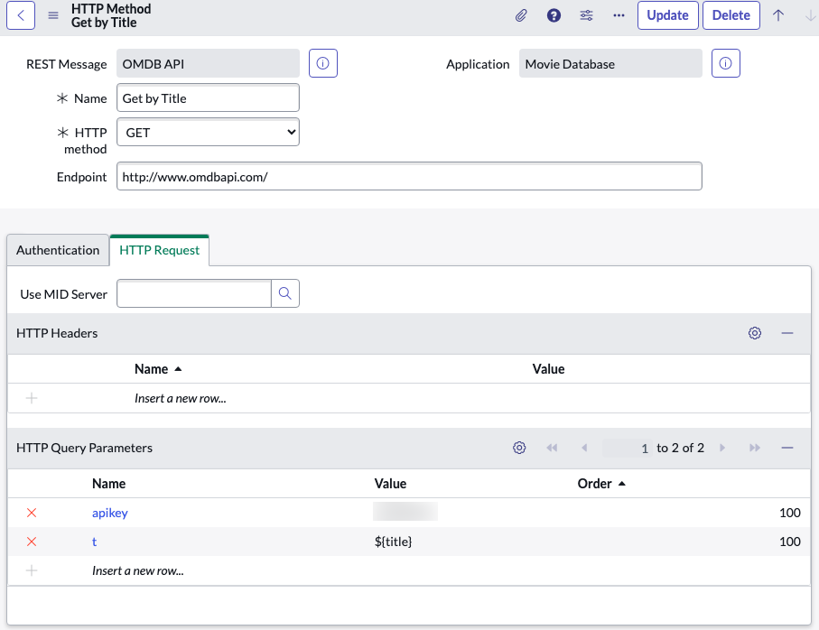

# How to migrate from scripted integration to Integration Hub

If qou are a ServiceNow customer for quite some years by now, you surely have integrated the platform with other systems in your company. Most likely you have used [web service integrations](https://docs.servicenow.com/bundle/utah-api-reference/page/integrate/web-services/reference/r_AvailableWebServices.html) leveraging SOAP or REST endpoints. While this works, ServiceNow offers newer and better capabilities as part of [Automation Engine](https://www.servicenow.com/products/automation-engine.html). This is the first blog of a series which will try to teach you how to migrate and what benefits you can expect doing so.

Blog post series:
- [Blog 1](***URL***) This blog to outline the scenario
- [Blog 2](***URL***) _coming soon_: Replacing scripted web service with a custom spoke action
- [Blog 3](***URL***) _coming soon_: Replacing scripted integration with Flow Designer
- [Blog 4](***URL***) _coming soon_: Replacing Remote Table Script
- [Blog 5](***URL***) _coming soon_: Summary and Benefits

## The scenario

### Custom app: Movie Database

To explain the concepts and steps we need some examples. For this purpose I have crafted a custom application to manage movies in ServiceNow. Quite simple, an app with a table depicting some movie details. I used [App Engine Studio](https://www.servicenow.com/products/app-engine-studio.html) to create a new scoped application to host all artifacts required.

Lets start by having a look at the data tables:


1. Person

    Holds information about involved persons, like directors.

2. Movie

    Holds information about a movie, including references to persons and other master data like country or languages.

    

As I am lazy, I do not want to enter all this data manually. For this purpose I have found a free web service called [The Open Movie Database](https://www.omdbapi.com/).

### Integration to OMDb API

OMDb provides some API endpoints to search for movies and to retrieve detailed information by title or ID. You can find all details on their [website](https://www.omdbapi.com/). Basically, all you need is an API key and some knowledge of the URLs. I decided to implement two API's as outbound REST web services. As both use the same API key and base url, they can easily be combined in one Rest Message record:


Notice that I did not select any authentication here as the API actually doesn't require it. All it needs is an URL parameter for the API key. We will see this in the next step.

1. Search by Title

This API will trigger OMDb to search for movies or shows by suppling a title - or a part of a title. The API will require two parameters: _api key_ to identify us and a search string _s_.


Both parameters are simply passed as URL query parameters. I decided to put the API key hard-coded in the method configuration. You could get more creative in storing this in a system property if you want.

The result for this API is a JSON array of matching movies. We will see later on how to parse and use them.

1. Get by Title

This API works very similar to a search, with the difference that a result contains way more information about the movie itself. It is intended to return only one record. The search can be done via an ID if known, or by title. I'll use the title again.



### Get Movie Details for new Movie records

Somehow we need to trigger our integration endpoints now when a new movie record is created. Traditionally this had to be Business Rules. For this I created an asnyc BR on insert and update to trigger everytime a title changes. This will then trigger my REST method _Get by Title_ to fetch the needed data. As a good developer I opted to put my code in a Script Include and have the BR call it. The BR script is therefor quick and easy:

```javascript
	var oh = new OMDBMovieHelper();
	oh.getOMDBData(current);
```

The whole integration magic happens in the Script Include OMDBMovieHelper. I'll spare you from the full code, you can look at this in the github repository if you want. The essential part though is here:

```javascript
            var r = new sn_ws.RESTMessageV2('OMDB API', 'GET by Title');
            r.setStringParameterNoEscape('title', gr_movie.title);

            var response = r.execute();
            var responseBody = response.getBody();
            var httpStatus = response.getStatusCode();

            if (httpStatus == '200') {
                var oResponse = JSON.parse(responseBody);
                if (oResponse.Response == "True") {

                    // extracting
                    gr_movie.year = oResponse.Year;
                    gr_movie.rated = oResponse.Rated;
                    gr_movie.plot = oResponse.Plot;
                    gr_movie.genre = oResponse.Genre;
                    gr_movie.imdb_rating = oResponse.imdbRating;
                    gr_movie.setValue('released', this.parseDate(oResponse.Released));

```

The script starts extracting the data after successfully retrieving it from the API. Most of it is straight forward, but some fields require extra care. In this case we have a date field containing the release date of the movie. As this does not come in a format ServiceNow understands, parsing and convertion requires some string manipulation. Other elements with extra care are reference fields where the correct reference record (sys_id) needs to be looked up. One example is the director of the movie. In the section above I illuted an extra table for persons. So the integration has to lookup values there and create a new record if not existing.

```javascript
                    // find director
                    var grDir = new GlideRecord('x_snc_movie_data_0_person');
                    grDir.addQuery('name', oResponse.Director);
                    grDir.addQuery('role', 'Director');
                    grDir.query();
                    // there can only be one...
                    if (grDir.next()) {
                        gr_movie.director = grDir.sys_id;
                    } else {
                        //... if not, create
                        grDir.initialize();
                        grDir.name = oResponse.Director;
                        grDir.role = 'Director';
                        var new_dir = grDir.insert();
                        gr_movie.director = new_dir;
                    }
```

Similar logic has been created for languages and countries, only that the look up targets standard tables like cmn_country or sys_language.

### Entering new movies

Obviously we do not want users to enter any kind of arbitrary movie records to our table, we only want legit movies which are known by the OMDb. To integrate the search I created a record producer.


I used two variables on this form, the first is a free text field to enter a part of a movie title. Using a Catalog Client Script I will run a search on OMDb with that onChange - basically when the user leaves the field. The script will then do an AJAX call to run the integration and return the found movies. Again I am referring to the Script Include already in place to keep the client script part short:

```javascript
function onChange(control, oldValue, newValue, isLoading) {
    if (isLoading || newValue == '') {
        return;
    }

    //Type appropriate comment here, and begin script below
    g_form.clearOptions('title');

    var gaMovieSearch = new GlideAjax('x_snc_movie_data_0.OMDBAjaxHelper');
    gaMovieSearch.addParam('sysparm_name', 'searchMovie');
    gaMovieSearch.addParam('sysparm_searchtitle', newValue);
    gaMovieSearch.getXML(responseHandler);

}


function responseHandler(response) {
    var tmpData = response.responseXML.documentElement.getAttribute("answer");
    if (tmpData != null) {
        var resultJSON = JSON.parse(tmpData);
        for (var i = 0; i < resultJSON.length; i++) {
            g_form.addOption('title', resultJSON[i].title, resultJSON[i].title);
        }
    }
}
```

### Summary

This concludes the demo scenario. As you can see, it is stripped down to simple use cases. Real life integration scenarios in your environment are probably way more complex. It will still serve the purpose to highlight some techniques and patterns to revamp an your integration and transform it in a Integration Hub Spoke bases setup.

Comment below if you feel I made a mistake in the scenario or if you have something which you feel is not covered in here but does need answer in such a move.