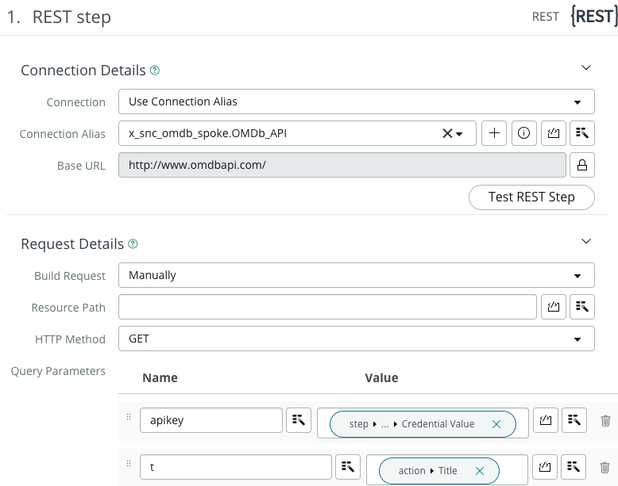
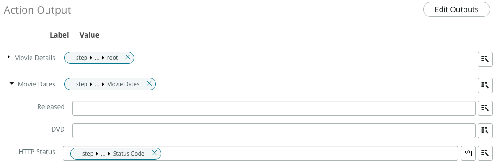

# Replace scripted web service with custom spoke

This blog post is #2 in a series of posts where I show you how to migrate from a more traditionally implemented integration using scripted [web services](https://docs.servicenow.com/bundle/utah-api-reference/page/integrate/web-services/reference/r_AvailableWebServices.html) to a modern Flow and Integration Hub based one. In this post we will be replacing the scripted web service with a custom spoke but still use all the other scripts as before with only minor modifications to them.

If you have not yet seen the other blog posts, please check them out here:
- [Blog 1](***URL***) Introducing the scenario
- [Blog 2](***URL***) Replacing scripted web service with a custom spoke action
- [Blog 3](***URL***) _coming soon_: Replacing scripted integration with Flow Designer
- [Blog 4](***URL***) _coming soon_: Replacing Remote Table Script
- [Blog 5](***URL***) _coming soon_: Summary and Benefits


## Replace scripted web service with custom spoke

### Create the spoke

There is a great [Creator Toolbox session](https://developer.servicenow.com/blog.do?p=/post/creatortoolbox-creating-custom-spokes/) and a bespoke course on [NowLearning](https://nowlearning.servicenow.com/lxp/en/automation-engine/integration-hub-create-new-spokes?course_id=78eb862f1bf67890ab8bda03b24bcb78&id=learning_course_prev) on how to create a custom spoke. I'll refer to those for more details. In this blog I highlight the relevant areas and how to use the new spoke in my already build scripts.

By definition, each spoke for Integration Hub has its own scope. We could use the existing *Movie Database* application scope. This is a feasable approach considering the integration is bespoke to this application. If we plan a bit ahead, we might want to reuse the spoke action in another application, make it available via [ServiceNow's share platform](https://developer.servicenow.com/connect.do#!/share) or just be prepared to replace it with another movie database at a later point in time. In any of these cases it is a good idea to carve out the integration elements to a separate scope. For this I opted to do exactly that and created a new scope [OMDb Spoke](https://github.com/phifogg/now_omdb_spoke). The scope was created in Developer Studio with no furter selection - just a naked scope.

As a first element we need to define the *Connection & Credential Alias*. Either from within Developer Studio (**Create Application File -> Connection & Credential Alias**) or from classic UI (**Integration Hub -> Connections & Credentials -> Connection & Credential Alias -> New**) create a new record and define the basic settings:


For more details on this step check out our [product documentation on creating a credential and alias record](https://docs.servicenow.com/csh?topicname=connection-alias.html&version=latest).

I'd like to point out the attribut for *Configuration Template*. This is not required, but allows a simpler maintenance of Connection & Credential records by providing a new modal dialog. In our scenario we do know that the API only requires an API Key, hence we can use the API Key Demo Configuration option.

Click on the related link for **Create New Connection & Credential**, this will open a modal window with the configuration template used. Supply the values as

Field | Value
----|----
Connection Name | OMDb Spoke Connection
Connection URL | https://www.omdbapi.com
API Key | <the api key for OMDb API as outlined in blog 1>

TODO: Test this step on new instance

With the alias and connection created, we can move forward and create the Integration Hub Action. Best is to open **Process Automation -> Flow Designer**. If you prefer, you can also do that from Developer Studio, but it will bring you into Flow Designer as well. For every API call to an external system we need a bespoke action to handle it. In our case we need two to replace the calls to *Search by Title* and *Get by Title*.

1. Get by Title

    In Flow Designer click on **New -> Action** and provide the details as shown

    

    **Note:** First time you do this, the category options are empty. Open the search and click **New** to create a meaningful category. We will see this category later when we use the action in a flow.

    To get details for a title, the action needs to know which title we want to get details for. Create an input for the movie title by clicking on **Inputs** in the *Action Outline* area. I used a simple string and defined it to be mandatory.

    

    The magic part for the integration is adding the REST step to connect to the OMDB Api. For this, click the **Plus (+)** icon below *Inputs* in the Action outline area. Search for *REST* to find our [Rest step](https://docs.servicenow.com/bundle/vancouver-integrate-applications/page/administer/flow-designer/reference/rest-request-action-designer.html).

    **Note:** REST step is not available in the base system and requires the ServiceNow® Integration Hub subscription. After the required plugin is activated, the step is visible under Integrations.

    The configuration for this step is quite simple. All we need is to select the alias we created earlier and build the request content manually as shown here:

    

    By selecting an alias we also get the credential value - the API Key in this case - as a data pill on the right hand side. All you need to do is adding two attributes to the query parameters for **apikey** and **t**. Use the data pills available to provide runtime values.

    With that you are ready for your first test of this particular step. Click on **TEST** next to *Publish*, provide a movie title and run your action. It should connect to OMDb API and fetch details from it in a JSON format. So this was at least not more difficult than it was in the traditional way, right? Let's get to the real power now.

    To parse the response body into actionable data objects we just add a step called **JSON Parser step**. Like before, click on the **Plus (+)** and find this step.

    **Note:** This action comes also as part of the payed Integration Hub package and is included in a plugin called *ServiceNow IntegrationHub Action Step - JSON Parser* (Id: com.glide.hub.action_step.jsonparser).

    Map the **Source data** input to response body data pill.

    

    If you still have your operations tab open from the test run go and fine the response body returned from the API. It will look something like this:

    ```json
    {"Title":"Dune","Year":"2021","Rated":"PG-13","Released":"22 Oct 2021","Runtime":"155 min","Genre":"Action, Adventure, Drama","Director":"Denis Villeneuve","Writer":"Jon Spaihts, Denis Villeneuve, Eric Roth","Actors":"Timothée Chalamet, Rebecca Ferguson, Zendaya","Plot":"A noble family becomes embroiled in a war for control over the galaxy's most valuable asset while its heir becomes troubled by visions of a dark future.","Language":"English, Mandarin","Country":"United States, Canada","Awards":"Won 6 Oscars. 171 wins & 283 nominations total","Poster":"https://m.media-amazon.com/images/M/MV5BN2FjNmEyNWMtYzM0ZS00NjIyLTg5YzYtYThlMGVjNzE1OGViXkEyXkFqcGdeQXVyMTkxNjUyNQ@@._V1_SX300.jpg","Ratings":[{"Source":"Internet Movie Database","Value":"8.0/10"},{"Source":"Rotten Tomatoes","Value":"83%"},{"Source":"Metacritic","Value":"74/100"}],"Metascore":"74","imdbRating":"8.0","imdbVotes":"710,207","imdbID":"tt1160419","Type":"movie","DVD":"22 Oct 2021","BoxOffice":"$108,327,830","Production":"N/A","Website":"N/A","Response":"True"}
    ```

    Copy that string into the text area below the *Source* panel on the JSON Parser step and click on **Generate Target**. This will parse the sample string provided and generate a structure on the right hand side depicting all found entities matching 1:1. You can also setup your own target structure but you will need to map the entities in the source structure manually then - allowing maximum flexibilty. 

    

    If you remember from the first blog post, there are some date elements recieved by OMDb which do not directly fit ServiceNow's date format. We could leave the transformation to whoever uses the spoke action, but it would be a nice convenience factor if we cover it as part of the action. So let's add another step executing a transformation script. Click the **Plus (+)** again below *JSON Parser* and search for Script Step. This will allow to execute any arbitrary script either on the application server or even on a MID server if needed. In our case Instance is fine, all we need is access to the JSON body returned from the web service.

    We already have the function needed in the OMDBMovieHelper Script Include from blog 1, using that script include though would create a dependency on the spoke to have our Movie application installed (Cross Scope Access Policy). Since we want our spoke to be self contained I'll copy the code to the script step here. In a later step we can them remove the function from the Movie application.

    The script used is this:

    ```JavaScript
    (function execute(inputs, outputs) {
  
    // parses a date in format DD MMM YYYY, returns a GlideDateTime object
    function parseDate(dateString) {
            var dateParts = dateString.split(' ');
            var day = dateParts[0];
            var month = dateParts[1];
            var year = dateParts[2];
            var monthMap = {
                'Jan': '01',
                'Feb': '02',
                'Mar': '03',
                'Apr': '04',
                'May': '05',
                'Jun': '06',
                'Jul': '07',
                'Aug': '08',
                'Sep': '09',
                'Oct': '10',
                'Nov': '11',
                'Dec': '12'
            };
            var monthNumber = monthMap[month];
            return year + '-' + monthNumber + '-' + day;
        };

  
        var mvs = {
	        Released: parseDate(inputs.movie_details.Released),
 	        DVD: parseDate(inputs.movie_details.DVD)
        }
  
        outputs.movie_dates = mvs;
  
    })(inputs, outputs);
    ```

    The last bit is to define inputs and outputs for the script step:

    

    


    With that the action as such is complete. The only missing element is defining the outputs for the whole action. Basically what this action returns to whomever calls it. Create two output parameters of type Object and one of type String, then map them as shown below. Notice, as you map the data pills, Flow Designer will inspect the object and generate all elements automatically for you. You can also get creative and define your own object and structure mapping to elements within rather then exposing the full objects received, similar to the JSON Parser step.

    

    With that, test the action again and see how the returned information is transformed and exposed as outputs.

1. Search by Title

    This one is basically the same as *Get by Title* simplified. It does not require and date transformation and hence just needs a REST and a JSON Parser step. With the instructions above you should be able to build that one quickly on your own. If you want to explore the finished version, checkout the Git repository and branch *blog_2*.

    TODO: Create branch in git and store objects linked to this blog step


1. Replace scripted web service in Script Include

    In the first blog post I introduced the Script Include *OMDBMovieHelper* which hosts all the logic to call the web services. We can simply replace these calls with calls to the Flow Designer Action. Flow Designer has the option to give us the needed stub code. Let's use the Get By Title one as an example. Open the action again in Flow Designer. 

    Once the action is published, click on the context menu icon and select **Create code snippet**

    

    This will generate all we need - there is even a Client version of the code if you need that. Copy the whole server content.

    Now open the script include *OMDBMovieHelper* either in Developer Studio or classic UI and find the method *getOMDBData*. Paste the code snippet to the start of the function. Now we need to do some cleanup and data mapping to and from the Flow Action. The finalized script part replacing the WebService call looks like this:

    ```JavaScript
        getOMDBData(gr_movie) {

        try {
            var inputs = {};
            inputs['title'] = gr_movie.title; // String 

            // Execute Synchronously: Run in foreground. Code snippet has access to outputs.
            var result = sn_fd.FlowAPI.getRunner().action('x_snc_omdb_spoke.get_by_title').inForeground().withInputs(inputs).run();
            var outputs = result.getOutputs();

            // Get Outputs:
            // Note: outputs can only be retrieved when executing synchronously.
            var movie_details = outputs['movie_details']; // Object
            var movie_dates = outputs['movie_dates']; // Object
            var http_status = outputs['http_status']; // String

            if (http_status == '200') {

                // extracting
                gr_movie.year = movie_details.Year;
                gr_movie.rated = movie_details.Rated;
                gr_movie.plot = movie_details.Plot;
                gr_movie.genre = movie_details.Genre;
                gr_movie.imdb_rating = movie_details.imdbRating;
                gr_movie.setValue('released', movie_dates.Released);
    ```

    This code is merely the same complexity as our old style Web Service Call, but it does leverage the new Integration Hub Spoke.