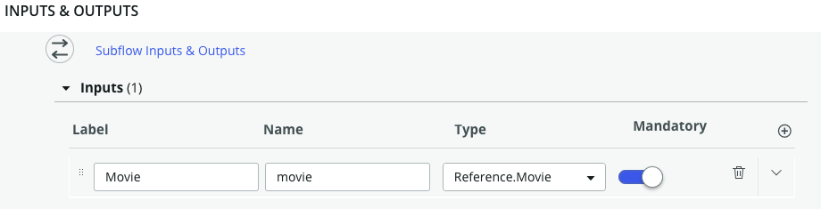
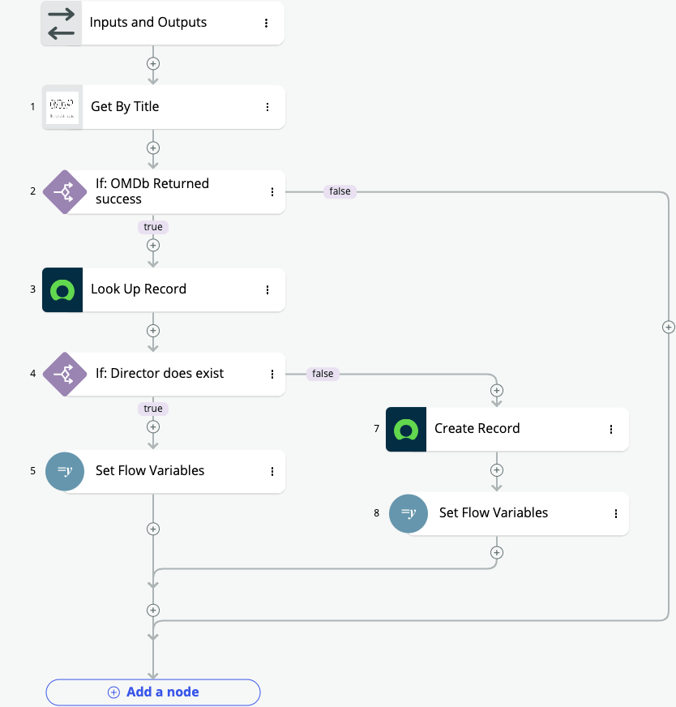
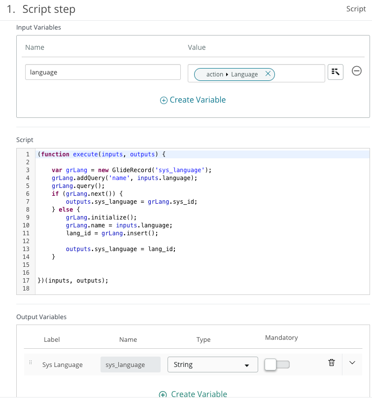
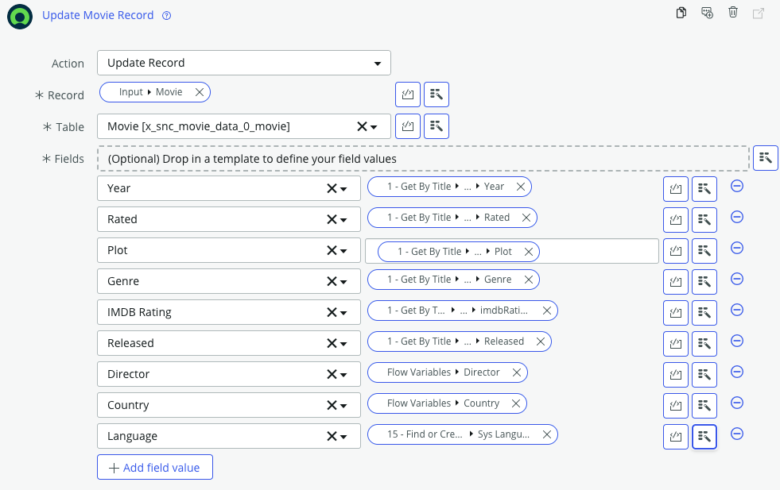
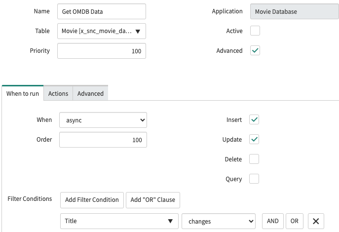
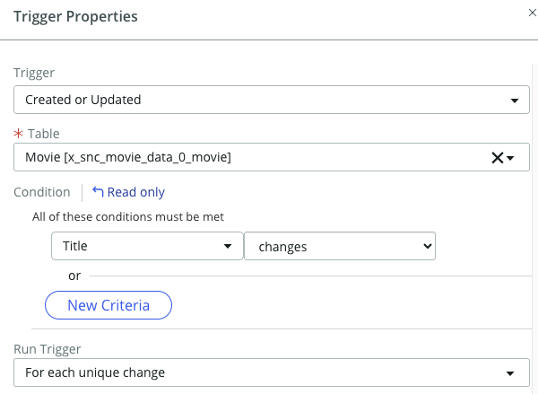
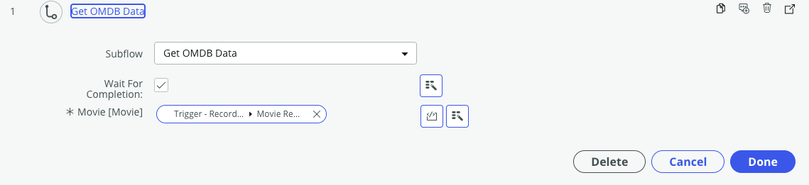
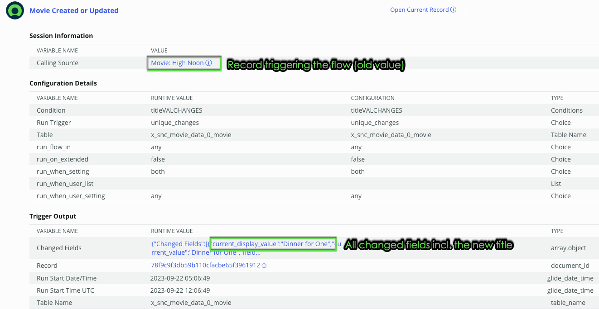

# How to migrate from scripted integration to Integration Hub - Part 3

<!-- Published URL
https://www.servicenow.com/community/automation-engine-blog/how-to-migrate-from-scripted-integration-to-integration-hub-part/ba-p/2681339
-->

This blog post is #3 in a series of posts where I show you how to migrate from a more traditionally implemented integration using scripted [web services](https://docs.servicenow.com/bundle/utah-api-reference/page/integrate/web-services/reference/r_AvailableWebServices.html) to a modern Flow and Integration Hub based one. In this post we will be replacing the all scripts from the scenario with low code elements of Flow Designer.

If you have not yet seen the other blog posts, please check them out here:
- [Blog 1](https://www.servicenow.com/community/automation-engine-blog/how-to-migrate-from-scripted-integration-to-integration-hub-part/ba-p/2675520) Outline of the scenario
- [Blog 2](***URL***) Replacing scripted web service with a custom spoke action
- [Blog 3](***URL***) This blog on replacing scripted integration with Flow Designer
- [Blog 4](***URL***) _coming soon_: Replacing Remote Table Script
- [Blog 5](***URL***) _coming soon_: Summary and Benefits

## Replacing scripted integration with Flow Designer

### Script Include

Flow Designer and low code tools do not directly offer a concept of a Script Include to host multiple functions. What we can do is to create a subflow for each function of a script include and store these functions in a bespoke category - this is as close as it gets. Let's check out the Script Include part for retrieving data from OMDB.

In Blog Post 2 we have already updated the function _getOMDBData_ to use the spoke action instead of classic scripted web service API. Now we are taking it one step further by rebuilding the function as new subflow. Subflows provide inputs and outputs, similar to a scripted function. In this example we only need an input record for the Movie:

With that we can start rebuilding the script logic with Flow Designer. This is mostly a straight forward thing of replacing code with steps piece by piece. Lookups to find the Person or Country Record are easy to do in Flow Designer. In this case we can use the setting 'Don't fail on error' for the Look Up step which allows the flow to react and create a record if required. The flow also uses Flow Variables to keep track of found or created reference records so we know later on which one to store in the movie record.

Here is a representation how the first part of the flow looks like rebuilt:

The lookup to sys_language poses an extra challenge as by default Flow Designer does not allow us to lookup records in certain system tables - including sys_language. For this we need to trick a little and create ourselves a new Action to script the lookup. Like in the second part of this series I created a new Action which uses a language string as input. With that a script step does exactly what the previous Script Include did and finally it returns either the found or the newly created record.

>*Note*: It is fairly simple to use a script step in an Action. Technically you could have the whole script include function here and still rely on heavy scripting. While this might be an approach to gradually move over to Flow Designer, I do not recommend to put lengthy scripts here. They are not as easy to find and maintain going foward. Treat action step scripts more as trigger elements and have larger code blocks still in Script Includes.

Finally, when all data is available to the flow it is a simple mapping exercise for all values to the right place in Update Record - again, very similar to the scripted mapping from before.

### The business rule

In blog post 1 I showed a business rule which is triggered when a new record is inserted into the movie table. Let's inspect this for some more details:

A quite classic or standard trigger definition, run asynchronously on Insert and Update when Title changes. A flow trigger can accommodate the exact same thing:

Using a flow will also enable other features hardly available on Business Rules like running the flow as the user triggering it (aka user initiating the session) or as system account. This is a very useful feature to keep your security in place. Business Rules usually use GlideRecord API which uses a system context by default potentially exposing data which might not be available to the user regularly. You can even specify which roles have to be used when executing a flow, i'll talk a bit more on that in the last blog post.

With the trigger sorted, all we need to do is to call the prepared subflow and pass in the triggering record.

Finally, deactivate (or delete) the old Business Rule.

### Testing

As before, make sure that [Flow reporting](https://docs.servicenow.com/bundle/vancouver-build-workflows/page/administer/flow-designer/task/enable-flow-reporting.html) is turned on to see what is happening. This is anyhow a good idea for a development environment. With that, create a new Movie record or change an existing one and wait for the Flow to kick in and do its magic. It might take a few seconds like any asynchronous action. You can see the execution as it runs or after the fact from Flow Designer. In the flow, use the context menu and check for **Executions**.

You can even drill down to the called subflow and actions to follow every step.

### Summary

As you can see, building a flow is not more difficult than scripting your way. But it does offer more flexibility and easier maintenance going forward. Flow reporting is a great utility when it comes to debug issues with the flow execution. Like in the previous blog posts, if you want to follow along checkout the matching branch Blog3_flow in the [Movie Database Github Repository](https://github.com/phifogg/now_movie).

Join me in the next blog post on replacing the search API with a remote table for even better usability. 