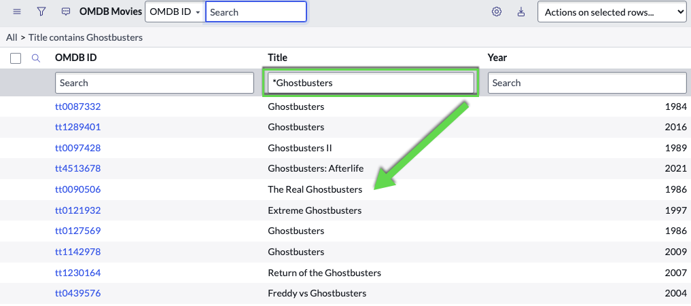
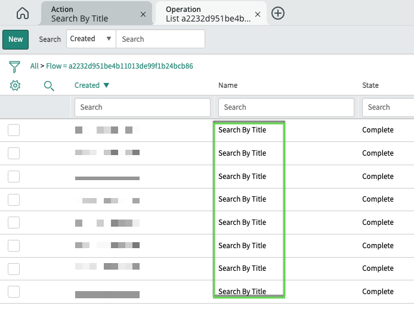

# How to migrate from scripted integration to Integration Hub - Part 4

<!-- Published URL
https://www.servicenow.com/community/automation-engine-blog/how-to-migrate-from-scripted-integration-to-integration-hub-part/ba-p/2689736
-->

This blog post is #4 in a series of posts where I show you how to migrate from a more traditionally implemented integration using scripted [web services](https://docs.servicenow.com/bundle/utah-api-reference/page/integrate/web-services/reference/r_AvailableWebServices.html) to a modern Flow and Integration Hub based one. In this post we will be replacing a scripted search with a Remote Table configuration.

If you have not yet seen the other blog posts, please check them out here:
- [Blog 1](https://www.servicenow.com/community/automation-engine-blog/how-to-migrate-from-scripted-integration-to-integration-hub-part/ba-p/2675520) Outline of the scenario
- [Blog 2](***URL***) Replacing scripted web service with a custom spoke action
- [Blog 3](***URL***) This blog on replacing scripted integration with Flow Designer
- [Blog 4](***URL***) _coming soon_: Replacing Remote Table Script
- [Blog 5](***URL***) _coming soon_: Summary and Benefits

## Movie Search

Another element in the outlined scenario is the search for a movie. For this I created a record producer which uses a GlideAjax call to trigger the REST integration fetching movie titles. You can find the script details in [Blog 1](https://www.servicenow.com/community/automation-engine-blog/how-to-migrate-from-scripted-integration-to-integration-hub-part/ba-p/2675520) or in the [GitHub repository](https://github.com/phifogg/now_movie).

We could now update the Script Include on the back of the Ajax call to leverage a flow action in the same way as we update the GetOMDBData function. Instead though I want to show you another option reducing the scripting need even further: [Remote Tables](https://docs.servicenow.com/csh?topicname=remote-tables.html&version=latest)

Remote Tables are a great feature if you want to pull in live information from a 3rd party system if that system has an webservice exposed and if the volume of data needed is rather small.

### Define the Remote Table Structure

A remote table behaves just like any other table in ServiceNow with some extras. The important part ist that no data is stored in the database, all data is only in memory at the time of a read operation. This automatically implies all data is read-only, there is no write-back function to the source. As the data is dynamic in nature, it is also on a per user (session) basis. One user will see different data in the same table as another user - based on the query they executed. By default, there is a limit of 1000 rows per user to limit the impact on your application nodes memory.

With that said, let's create a new table to define the structure of the data we want to surface as result of a movie search. I decided to put this table in the scope of our already created ODMb spoke as the search is tightly linked to the API of OMDb.

The API does return information like Title, Year and OMDb-ID which we want to use here. You could add more fields to the table, but these are the ones I chose:

To create this structure you need to use the navigator menu **Remote Tables -> Tables**. It will create the same entries in sys_db_object and sys_dictionary as you know from regular tables with one difference. The table will be flagged as *Remote Table*, a field you typically do not see on the form.


I do recommend to activate *Create module* while creating the table. This will allow  a quick access to it which can be used for testing. I'll come back to this a bit later in this blog.

### Define the Remote Table Content

With the table structure defined we need to tell the system how to find the data whenever somebody looks at this table. For this go to **Remote Tables -> Definition**.

As you can see, the definition is basically a script which will pull in the data. You could use the previous Script Include leveraging the scripted Web Services or the newer method of an Integration Hub Action. The definition script has access to two objects:

| Object | Description | API Documentation |
| ------ | ----- | ------|
| v_table | The target table content being displayed to the user. Main method is _addRow_ | https://docs.servicenow.com/csh?topicname=v_tableAPI.html&version=latest|
| v_query | Access to the query paramters as entered by the user | https://docs.servicenow.com/csh?topicname=v_queryAPI.html&version=latest|

You can get as creative and complicated as needed with parsing the query and formulating the input to an API. In my case I want to support an EQUALS and a CONTAINS query. These two are available in the *v_query* object as *getParameter* and *getCondition*. A few lines of code will allow us to support both and pass the correct search text to the API. Here is the final script

```javascript
(function executeQuery(v_table, v_query) {

    var title = v_query.getParameter('title');
    var title_query = v_query.getCondition('title');
    if (!gs.nil(title_query)) {
        title_query = title_query.split('LIKE');
        if (title_query.length > 1) {
            title = title_query[1];
        }
    }

    try {
        var inputs = {};
        inputs['title'] = title; // String 

        var result = sn_fd.FlowAPI.getRunner().action('x_snc_omdb_spoke.search_by_title').inForeground().withInputs(inputs).run();
        var outputs = result.getOutputs();

        // Get Outputs:
        var strMovies = outputs['movies']; // Array.Object
        var movies = strMovies.Search;

        for (var i = 0; i < movies.length; i++) {
            v_table.addRow({
                "title": movies[i].Title + '',
                "year": movies[i].Year + '',
                "imdb_id": movies[i].imdbID + '',
                "sys_id": movies[i].imdbID + ''
            });
        }


    } catch (ex) {
        gs.error(JSON.stringify(ex));
    }

})(v_table, v_query);
```


### Testing the Remote Table

If you created the module when creating the table, you can simple navigate to the new table via the Navigator. Once you see the table, there will be no records. This is intended, as we want this table to be a search. Start a search on the title column with either an equality or contains (= or *) search and you should get a result:



Everytime you trigger a search, you will also be able to find an execution context on the action:



Depending on your Flow Reporting settings you can drill into any of these and see inputs, outputs and all intermediate steps. If something didn't work, start here with you trouble shooting.

## Catalog Item

I introduced a record producer in Blog 1 to help users creating a new movie record. For this part of the blog I created another record producer to highlight how a remote table can be used here.

Have a look at the **New Find a Movie** record producer. This time only one variable is exposed which is of type reference pointing to the newly created Remote Table. When this record producer opens, there is no record in the Movie table, hence the reference field does not auto-complete any records. If we open the search and enter a search query like * *Star Wars*, the query is executed and results show. We can than simply select one and click submit.


I used a similar trick as before by populating a second variable with the selected movie title. The second variable is hidden as the user doesn't need to worry about it. All it does is serve as kind of a scratchpad to store the title string. This is required as the server side script executed by the record producer does not have access to the same content in the Remote Table as the user. All it would receive is the sys_id of the remote table.

The little workaround using an extra variable could be avoided by a few extra steps:
1. Create a new field on Movie table to store the ODMb ID
1. Create a new spoke aciton to get movie details by OMDb ID instead of title
1. Instead of using the hidden variable to store the movie title, map the reference field to the OMDb-ID field created above
1. Change the flow triggering on new movie records to watch for ID changes instead of title

## Summary

Remote Tables provide a powerful and easy way to surface data from 3rd party systems in real time. While they can be used with traditional web services, we do recommend to pair them with Integration Hub Actions. The implementation effort is similarly small and allows a greater flexibility when it comes to maintenance. I'll talk more about the benefits in the next blog.
