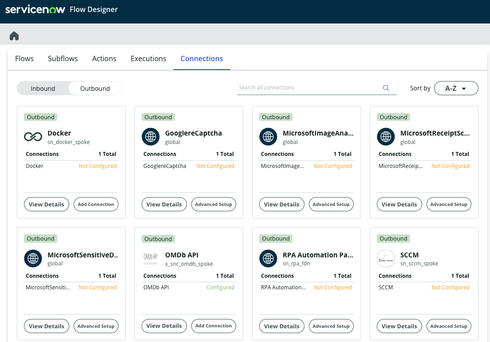
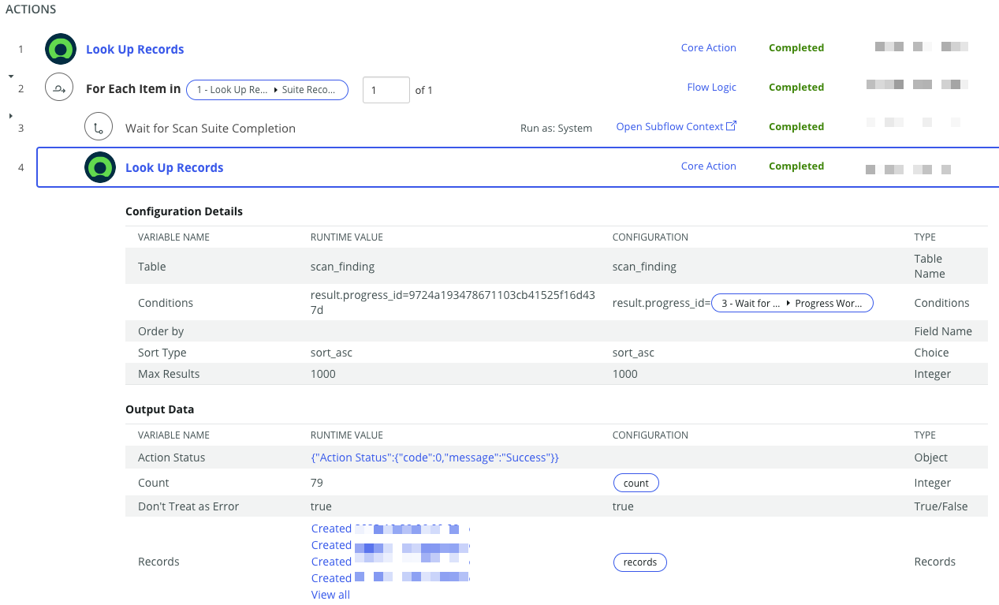
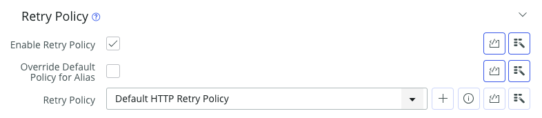

# How to migrate from scripted integration to Integration Hub - Part 5

<!-- Published URL
-->

This blog post is #5 in a series of posts where I show you how to migrate from a more traditionally implemented integration using scripted [web services](https://docs.servicenow.com/bundle/utah-api-reference/page/integrate/web-services/reference/r_AvailableWebServices.html) to a modern Flow and Integration Hub based one. In this post I will summarize what we have achieved and what the benefits are including some resources to take this further.

If you have not yet seen the other blog posts, please check them out here:
- [Blog 1](https://www.servicenow.com/community/automation-engine-blog/how-to-migrate-from-scripted-integration-to-integration-hub-part/ba-p/2675520) Outline of the scenario
- [Blog 2](***URL***) Replacing scripted web service with a custom spoke action
- [Blog 3](***URL***) This blog on replacing scripted integration with Flow Designer
- [Blog 4](***URL***) _coming soon_: Replacing Remote Table Script
- [Blog 5](***URL***) _coming soon_: Summary and Benefits

## Summary of achievement

Over these series of blog post I have shown you how to replace a scripted - i.e. traditional - implementation of an integration to a more moden low code approach. I used the OMDb API which is publically and freely available as an example. This included two different endpoints to search for a movie and retrieve detailed information about a given movie.

We replaced scripted business rules with modern Flow Designer based approach leveraging a newly created custom spoke for Integration Hub.

## Benefits

Obviously, we at ServiceNow do believe these new technologies are a significant improvement over our legacy options, and yes we do ask for a premium price for new features like IntegrationHub. So what are the benefits for you when using it?

### Low Code

As a professional developer you might argue that Low Code as such is not a criteria of importance to you. And yes, you are probably not faster in building the initial version of an integration wether you use a well-known scripted approach vs. something new and somewhat strange thing like Low Code.

I hope though that this blog series at least showed that the effort in building an integration is comparable for a simple integration like the OMDb one shown. Creating a new spoke and putting the web service calls in Actions within Flow Designer is not more complex than writing scripts. Would I recommend that this part should be done by lesser experiences developers or even Citizen Developers? No, I don't think so. To build a resilient integration I still believe you need a good level of expertiese in things like error handling and data mapping. Hence building out a spoke is still a task in the hands of professional developers. Once the spoke actions are available though, I do believe making these actions available to a Citizen Developer building out a business process using Flow Designer is becoming an option and much simpler than explaining someone how to develop and or use a script for the same activity.

So overall, using low code tools opens new possibilities not available with purely scripted implementations.

### Maintenance

Similarly to Low Code a professional developer might say that it is much easier for him or her to adapt a piece of code when time comes. But be honest, how often have you looked back at a piece of code you have written say 6 months ago and immediatelly knew what it does? Now consider it was not even your piece of code. Sure, we all have coding guidelines which show make this step better, like comment your code, name variables meaningfully etc. How well does it work in real life? 

Using a Low Code approach makes reading and understanding of implementations from months ago or from other developers much simpler. With a proper developed spoke, changing how the spoke operates will not impact the processes using the spoke actions. There are by default defined inputs and outputs decoupling different elements in the platform.

It is also much easier to find where a given spoke action is used. Try finding all the places someone could hide a piece of script to call your api.

### Credentials & Connections

All integrations need credentials of some shape or form. With scripted API's these credentials tend to be burried in lines of code. If you have implemented a few integrations you probably build your own best practice of maintaining these elements outside code like in properties or lookup tables.

With spokes all credentials are maintained securely in a central place within Flow Designer.

In addition, these Connection and Credentials are not deployed using Update Sets or App Repo. They are inntentionally marked as data and not configuration items. Most likely the connection and credentials will differ from development to test and production environments. Excluding them from deployment removes the risk of accidentially taking to the wrong endpoints. We also have default exclusion rules and data preservers in order to prevent these data elements from cloning back. This means after clone, your test instance will still point to test environments of other systems. No more manual work to reconfigure integrations post clone!

### Security

Another big point for a lot of companies is security around who can use certain integrations. Assume you want an integration to your core HR system to update user profile information. This can be a pretty critical interface which you do not want anyone on your developer community (e.g. Citizen Developers) to just use. With spokes you get a lot of controls to allow access the these actions or not.

[Content Filtering Rules](https://docs.servicenow.com/csh?topicname=configure-content-filtering-rules.html&version=latest) allow an administrator to define who can see certain spoke actions and who cannot - preventing unauthorized usage. 

The subflows using spoke actions can be set to run in the user's context or with explicit roles. All scripted integrations usually leverage a system account to execute having way more access then the user would have.

### Trouble Shooting & Error Handling

When an integration fails for some reason, finding the culprit can be really hard. In a traditional implementation you will most likely find yourself in staging test data and running them over and over again potentially looking at a Script Debugger window to follow the data traces trying to understand where a wrong data content has been passed in.

With Flow Designer it is easy to activate Flow Reporting for a bespoke flow - or a set of flows - which automatically generates a massive execution stack. You can quickly see all data elements, all decisions the flow made etc. 

This makes debugging a thing from the past.

All elements in Flow Designer have built in error handling possibilities. From Try-Catch logic to [automatic retries](https://docs.servicenow.com/csh?topicname=retry-policy.html&version=latest) at integration steps.

This allows from a very granular control at specific integration steps up to complex error handling routines at process level.

### Monitoring

- security on flows (run as, run with roles,....)
- Execution Details when reporting is on

- Instead of directly updating record use transform map?
